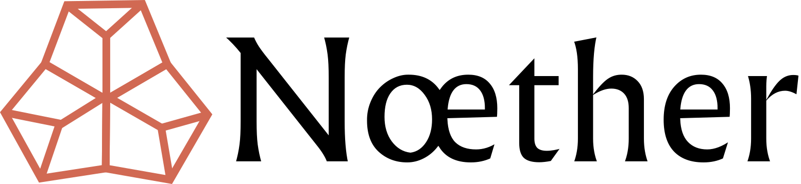

# Nœther

[](https://opensource.org/licenses/MIT)
[](https://crates.io/crates/noether)
[](https://docs.rs/noether)


Nœther provides traits and blanket implementations for algebraic structures, from basic ones like magmas to more
complex ones like fields, vector spaces, and tensors. It defines a comprehensive hierarchy of mathematical abstractions, organized in a modular structure that follows the natural progression of abstract algebra. It leans heavily on the basic traits available in std::ops and num_traits while adding rich mathematical documentation with formal definitions.

## Table of Contents

- [Background](#background)
  - [Inspirations](#inspirations)
- [Features](#features)
- [Installation](#installation)
- [Usage](#usage)
- [Core Concepts](#core-concepts)
- [Hierarchy of Algebraic Structures](#hierarchy-of-algebraic-structures)
- [Operator Traits for Algebraic Structures](#operator-traits-for-algebraic-structures)
- [API Overview](#api-overview)
- [Advanced Usage](#advanced-usage)
- [Performance](#performance)
- [Roadmap](#roadmap)
- [Contributing](#contributing)
- [License](#license)

## Background

Named after Emmy Nœther, a pioneering mathematician in abstract algebra, this library aims to bridge the gap between
abstract mathematics and practical programming in Rust. It enables developers to work with mathematical concepts in a
type-safe, efficient, and expressive manner.

The goal is to provide a common interface for working with algebraic structures in Rust. Interestingly, these traits can
be used to categorize implementations of various structs based on the properties they satisfy, and be applied in most
cases for anything from scalar values to n-dimensional arrays.

### Inspirations

Nœther draws inspiration from several existing libraries and projects in the field of computational algebra:

1. [simba](https://crates.io/crates/simba): A Rust crate for SIMD-accelerated algebra.

2. [alga](https://github.com/dimforge/alga): A Rust library for abstract algebra, providing solid mathematical
   abstractions for algebra-focused applications. alga defines and organizes basic building blocks of general algebraic
   structures through trait inheritance.

3. [algebra](https://github.com/brendanzab/algebra): A Rust library for abstract algebra that organizes a wide range of
   structures into a logically consistent framework. It aims to create composable libraries and APIs based on algebraic
   classifications.

These libraries demonstrate the power and utility of representing algebraic structures in programming languages. Nœther
builds upon their ideas, aiming to provide a comprehensive and ergonomic framework for working with algebraic structures
in Rust.

Other notable inspirations from different programming languages include:

- Haskell's [Numeric Prelude](http://www.haskell.org/haskellwiki/Numeric_Prelude) and Edward A.
  Kmett's [algebra package](http://hackage.haskell.org/package/algebra-3.1)
- Agda's [algebra module](http://www.cse.chalmers.se/~nad/listings/lib-0.7/Algebra.html)
- Idris' [algebra module](https://github.com/idris-lang/Idris-dev/blob/master/libs/prelude/Prelude/Algebra.idr)
- Scala's [spire](https://github.com/non/spire)

Nœther also draws insights from academic papers in the field:

- [The Scratchpad II Type System: Domains and Subdomains](http://www.csd.uwo.ca/~watt/pub/reprints/1990-miola-spadtypes.pdf)
- [Fundamental Algebraic Concepts in Concept-Enabled C++](ftp://cgi.cs.indiana.edu/pub/techreports/TR638.pdf)

Nœther aims to bring the best ideas from these libraries and research to the Rust ecosystem, while taking advantage of
Rust's unique features like zero-cost abstractions and powerful type system.

## Features

- Traits for a wide range of algebraic structures (e.g., Magma, Semigroup, Monoid, Group, Ring, Field)
- Marker traits for important algebraic properties (e.g., Associativity, Commutativity)
- Blanket implementations to reduce boilerplate code
- Support for both built-in and custom types
- Zero-cost abstractions leveraging Rust's type system
- Modular organization by mathematical domain
- Comprehensive UTF-8 mathematical documentation with formal definitions
- Type-level dimension handling for compile-time dimensional analysis
- Linear algebra abstractions including vector spaces, modules, and tensors
- Advanced structures like bilinear forms and tensor products

## Installation

Add this to your `Cargo.toml`:

```toml
[dependencies]
noether = "0.3.0"
```

## Usage

Here is a rough example of Z₅ (integers modulo 5) using Nœther:

```rust
use noether::{Field};
use std::ops::{Add, Sub, Mul, Div, Neg};

#[derive(Clone, Copy, Debug, PartialEq, Eq)]
struct Z5(u8);

impl Z5 {
    fn new(n: u8) -> Self {
        Z5(n % 5)
    }
}

impl Add for Z5 {
    type Output = Self;
    fn add(self, rhs: Self) -> Self {
        Z5((self.0 + rhs.0) % 5)
    }
}

impl Sub for Z5 {
    type Output = Self;
    fn sub(self, rhs: Self) -> Self {
        self + (-rhs)
    }
}

impl Mul for Z5 {
    type Output = Self;
    fn mul(self, rhs: Self) -> Self {
        Z5((self.0 * rhs.0) % 5)
    }
}

impl Div for Z5 {
    type Output = Self;
    fn div(self, rhs: Self) -> Self {
        if rhs.0 == 0 {
            panic!("Division by zero in Z5");
        }
        self * rhs.multiplicative_inverse().unwrap()
    }
}

impl Neg for Z5 {
    type Output = Self;
    fn neg(self) -> Self {
        Z5((5 - self.0) % 5)
    }
}

impl Field for Z5 {
    fn multiplicative_inverse(&self) -> Option<Self> {
        match self.0 {
            0 => None,
            1 | 4 => Some(*self),
            2 => Some(Z5(3)),
            3 => Some(Z5(2)),
            _ => unreachable!(),
        }
    }
}
```

This example shows how to construct a well factored finite field using Nœther,
leveraging Rust's native operators and traits.

## Core Concepts

1. **Algebraic Structures**: Traits representing mathematical structures with specific properties and operations.
2. **Marker Traits**: Traits like `Associative` and `Commutative` for compile-time property checks.
3. **Blanket Implementations**: Automatic implementations of higher-level traits based on more fundamental ones.
4. **Zero-Cost Abstractions**: Leveraging Rust's type system for efficiency without runtime overhead.
5. **Extensibility**: The library is designed to be easily extended with new types and structures.
6. **Type Safety**: Ensuring operations maintain closure within the same type and catching errors at compile-time.

## Hierarchy of Algebraic Structures

```text
                              ┌─────┐
                              │ Set │
                              └──┬──┘
                                 │
                              ┌──▼──┐
                              │Magma│
                              └──┬──┘
               ┌────────────────┼────────────────┐
               │                │                │
         ┌─────▼─────┐    ┌─────▼─────┐    ┌─────▼─────┐
         │Quasigroup │    │ Semigroup │    │Semilattice│
         └─────┬─────┘    └─────┬─────┘    └───────────┘
               │                │
           ┌───▼───┐        ┌───▼───┐
           │ Loop  │        │Monoid │
           └───┬───┘        └───┬───┘
               │                │
               └────────┐ ┌─────┘
                        │ │
                     ┌──▼─▼──┐
                     │ Group │
                     └───┬───┘
                         │
                ┌────────▼────────┐
                │  Abelian Group  │
                └────────┬────────┘
                         │
                    ┌────▼────┐
                    │Semiring │
                    └────┬────┘
                         │
                    ┌────▼────┐
                    │  Ring   │
                    └────┬────┘
          ┌───────────────────────┐
          │                       │
    ┌─────▼─────┐           ┌─────▼─────┐
    │  Module   │           │Commutative│
    └───────────┘           │   Ring    │
                            └─────┬─────┘
                                  │
                         ┌────────▼────────┐
                         │ Integral Domain │
                         └────────┬────────┘
                                  │
                    ┌─────────────▼─────────────┐
                    │Unique Factorization Domain│
                    └─────────────┬─────────────┘
                                  │
                      ┌───────────▼───────────┐
                      │Principal Ideal Domain │
                      └───────────┬───────────┘
                                  │
                         ┌────────▼────────┐
                         │Euclidean Domain │
                         └────────┬────────┘
                                  │
                              ┌───▼───┐
                              │ Field │────────────────────────┐
                              └───┬───┘                        │
                        ┌─────────┴──────────┐                 │
                        │                    │                 │
                  ┌─────▼─────┐        ┌─────▼─────┐     ┌─────▼─────┐
                  │   Finite  │        │ Infinite  │     │  Vector   │
                  │   Field   │        │   Field   │     │   Space   │
                  └─────┬─────┘        └───────────┘     └───────────┘
                        │
                  ┌─────▼─────┐
                  │   Field   │
                  │ Extension │
                  └─────┬─────┘
                        │
                  ┌─────▼─────┐
                  │ Extension │
                  │   Tower   │
                  └───────────┘
```

## Operator Traits for Algebraic Structures

This module defines traits for various operators and their properties, providing a foundation for implementing algebraic
structures in Rust.

An algebraic structure consists of a set with one or more binary operations. Let $S$ be a set (Self) and $\bullet$ be a
binary operation on $S$. Here are the key properties a binary operation may possess, organized from simplest to most
complex:

- (Closure) $\forall a, b \in S, a \bullet b \in S$ - Guaranteed by the operators provided
- (Totality) $\forall a, b \in S, a \bullet b$ is defined - Guaranteed by Rust
- (Commutativity) $\forall a, b \in S, a \bullet b = b \bullet a$ - Marker trait
- (Associativity) $\forall a, b, c \in S, (a \bullet b) \bullet c = a \bullet (b \bullet c)$ - Marker trait
- (Distributivity) $\forall a, b, c \in S, a * (b + c) = (a * b) + (a * c)$ - Marker trait

The traits and blanket implementations provided serve several important purposes:

1. Closure: All `Closed*` traits ensure that operations on a type always produce a result of the same type. This is
   crucial for defining algebraic structures.

2. Reference Operations: The `*Ref` variants of traits allow for more efficient operations when the right-hand side can
   be borrowed, which is common in many algorithms.

3. Marker Traits: Traits like `Commutative`, `Associative`, etc., allow types to declare which algebraic properties they
   satisfy. This can be used for compile-time checks and to enable more generic implementations of algorithms.

4. Extensibility: New types that implement the standard traits (like `Add`, `Sub`, etc.) will automatically get the
   closed trait implementations, making the system more extensible and future-proof.

5. Type Safety: These traits help in catching type-related errors at compile-time, ensuring that operations maintain
   closure within the same type.

6. Generic Programming: These traits enable more expressive generic programming, allowing functions and structs to be
   generic over types that are closed under certain operations or satisfy certain algebraic properties.

## API Overview

Nœther provides traits for various algebraic structures, including:

- `Magma`: Set with a binary operation
- `Semigroup`: Associative magma
- `Monoid`: Semigroup with identity element
- `Group`: Monoid where every element has an inverse
- `Ring`: Set with two operations (addition and multiplication) satisfying certain axioms
- `Field`: Commutative ring where every non-zero element has a multiplicative inverse
- `VectorSpace`: An abelian group with scalar multiplication over a field
- `Module`: Similar to a vector space, but over a ring instead of a field
- `Polynomial`: Represents polynomials over a field
- `FieldExtension`: Represents field extensions

Each trait comes with methods defining the operations and properties of the respective algebraic structure. For a
complete list of traits and their methods, please refer to the [API documentation](https://docs.rs/noether).

## Advanced Usage

Nœther's power lies in its ability to express complex mathematical concepts and algorithms generically. Here's an
example of a function that works with any type implementing the `Field` trait:

```rust
use noether::Field;

fn polynomial_evaluation<F: Field>(coefficients: &[F], x: F) -> F {
    coefficients.iter().rev().fold(F::zero(), |acc, &c| acc * x + c)
}

// This function works for any type implementing the Field trait
```

You can use this function with any type that implements the `Field` trait, whether it's a built-in numeric type or a
custom type like our `Z5` from the earlier example.

### Integrating External Numeric Types

Noether can be extended to work with third-party numeric types by creating wrappers that implement the appropriate traits. This section demonstrates how to integrate external numeric libraries with Noether's type system.

#### Example: Complex Numbers

Here's an example of how to wrap the `num_complex` crate's `Complex` type to work with Noether's algebraic structure traits:

````rust
use noether::operations::{
    CommutativeAddition, AssociativeAddition,
    CommutativeMultiplication, AssociativeMultiplication, Distributive
};
use noether::fields::FieldExtension;
use noether::spaces::VectorSpace;
use num_traits::{Num, One, Zero};
use std::ops::{Add, Mul, Div, Neg};

/// A wrapper around `num_complex::Complex` that implements Noether's algebraic traits.
///
/// This wrapper provides a complex number implementation that satisfies Noether's
/// algebraic structure traits, including `Field` and `FieldExtension` traits.
///
/// # Type Parameters
///
/// * `T` - The type of the real and imaginary parts.
///
/// # Examples
///
/// ```
/// use noether::primitives::Complex;
///
/// // Create a complex number
/// let z = Complex::<f64>::new(3.0, 4.0);
/// let w = Complex::<f64>::new(1.0, 2.0);
///
/// // Perform field operations
/// let sum = z + w;
/// let product = z * w;
/// let quotient = z / w;
/// ```
#[derive(Debug, Clone, Copy, PartialEq)]
pub struct Complex<T> {
   /// The underlying complex number from the num_complex crate
   inner: num_complex::Complex<T>,
}

impl<T: Clone + Num> Complex<T> {
   /// Creates a new complex number with the given real and imaginary parts.
   pub fn new(re: T, im: T) -> Self {
      Self {
         inner: num_complex::Complex::new(re, im),
      }
   }

   /// Creates a new complex number from a real value (imaginary part is zero).
   pub fn from_real(re: T) -> Self {
      Self {
         inner: num_complex::Complex::new(re, T::zero()),
      }
   }

   /// Creates the imaginary unit (0 + 1i).
   pub fn i() -> Self {
      Self {
         inner: num_complex::Complex::new(T::zero(), T::one()),
      }
   }

   /// Returns the real part of the complex number.
   pub fn re(&self) -> &T {
      &self.inner.re
   }

   /// Returns the imaginary part of the complex number.
   pub fn im(&self) -> &T {
      &self.inner.im
   }

   /// Returns the complex conjugate (re - i*im).
   pub fn conj(&self) -> Self
   where
           T: Neg<Output = T>
   {
      Self {
         inner: num_complex::Complex::new(
            self.inner.re.clone(),
            -self.inner.im.clone(),
         ),
      }
   }

   /// Returns the squared norm (|z|²) of the complex number.
   pub fn norm_sqr(&self) -> T {
      self.inner.re.clone() * self.inner.re.clone() +
              self.inner.im.clone() * self.inner.im.clone()
   }
}

// Implement the standard arithmetic operations by delegating to the inner Complex type

impl<T: Clone + Num> Add for Complex<T> {
   type Output = Self;

   fn add(self, other: Self) -> Self::Output {
      Self {
         inner: self.inner + other.inner,
      }
   }
}

impl<T: Clone + Num + AddAssign> AddAssign for Complex<T> {
   fn add_assign(&mut self, other: Self) {
      // Implement manually since num_complex might not have all the required traits
      self.inner.re += other.inner.re;
      self.inner.im += other.inner.im;
   }
}

impl<T: Clone + Num> Sub for Complex<T> {
   type Output = Self;

   fn sub(self, other: Self) -> Self::Output {
      Self {
         inner: self.inner - other.inner,
      }
   }
}

impl<T: Clone + Num + SubAssign> SubAssign for Complex<T> {
   fn sub_assign(&mut self, other: Self) {
      // Implement manually
      self.inner.re -= other.inner.re;
      self.inner.im -= other.inner.im;
   }
}

impl<T: Clone + Num> Mul for Complex<T> {
   type Output = Self;

   fn mul(self, other: Self) -> Self::Output {
      Self {
         inner: self.inner * other.inner,
      }
   }
}

impl<T: Clone + Num + AddAssign + SubAssign + MulAssign> MulAssign for Complex<T> {
   fn mul_assign(&mut self, other: Self) {
      // Manual implementation of complex multiplication
      let a = self.inner.re.clone();
      let b = self.inner.im.clone();
      let c = other.inner.re;
      let d = other.inner.im;

      // (a + bi) * (c + di) = (ac - bd) + (ad + bc)i
      let ac = a.clone() * c.clone();
      let bd = b.clone() * d.clone();
      let ad = a * d;
      let bc = b * c;

      self.inner.re = ac - bd;
      self.inner.im = ad + bc;
   }
}

impl<T: Clone + Num> Div for Complex<T> {
   type Output = Self;

   fn div(self, other: Self) -> Self::Output {
      Self {
         inner: self.inner / other.inner,
      }
   }
}

impl<T: Clone + Num + AddAssign + SubAssign + MulAssign + DivAssign> DivAssign for Complex<T> {
   fn div_assign(&mut self, other: Self) {
      // Manual implementation of complex division
      let a = self.inner.re.clone();
      let b = self.inner.im.clone();
      let c = other.inner.re.clone();
      let d = other.inner.im.clone();

      // Compute denominator: |c + di|^2 = c^2 + d^2
      let denom = c.clone() * c.clone() + d.clone() * d.clone();

      // (a + bi) / (c + di) = ((ac + bd) + (bc - ad)i) / (c^2 + d^2)
      let ac_plus_bd = a.clone() * c.clone() + b.clone() * d.clone();
      let bc_minus_ad = b * c - a * d;

      self.inner.re = ac_plus_bd / denom.clone();
      self.inner.im = bc_minus_ad / denom;
   }
}

impl<T: Clone + Num + Neg<Output = T>> Neg for Complex<T> {
   type Output = Self;

   fn neg(self) -> Self::Output {
      Self {
         inner: num_complex::Complex::new(-self.inner.re, -self.inner.im),
      }
   }
}

impl<T: Clone + Num> Rem for Complex<T> {
   type Output = Self;

   fn rem(self, other: Self) -> Self::Output {
      // Simple implementation, not mathematically ideal
      let div = self.clone() / other.clone();
      self - div * other
   }
}

impl<T: Clone + Num + RemAssign> RemAssign for Complex<T> {
   fn rem_assign(&mut self, other: Self) {
      // Simple implementation - not mathematically ideal for complex numbers
      let remainder = self.clone() % other;
      self.inner.re = remainder.inner.re;
      self.inner.im = remainder.inner.im;
   }
}

impl<T: Clone + Num> Zero for Complex<T> {
   fn zero() -> Self {
      Self {
         inner: num_complex::Complex::new(T::zero(), T::zero()),
      }
   }

   fn is_zero(&self) -> bool {
      self.inner.re.is_zero() && self.inner.im.is_zero()
   }
}

impl<T: Clone + Num> One for Complex<T> {
   fn one() -> Self {
      Self {
         inner: num_complex::Complex::new(T::one(), T::zero()),
      }
   }

   fn is_one(&self) -> bool {
      self.inner.re.is_one() && self.inner.im.is_zero()
   }
}

// Implement num_traits::Inv for Complex
impl<T: Clone + Num + Neg<Output = T>> num_traits::Inv for Complex<T> {
   type Output = Self;

   fn inv(self) -> Self::Output {
      let norm_sqr = self.norm_sqr();
      Self {
         inner: num_complex::Complex::new(
            self.inner.re / norm_sqr.clone(),
            -self.inner.im / norm_sqr
         ),
      }
   }
}

// Implement Euclid trait for Euclidean division
impl<T: Clone + Num + Euclid> Euclid for Complex<T> {
   fn div_euclid(&self, v: &Self) -> Self {
      // This is a simplified version; more sophisticated implementations
      // would use Gaussian integer division when appropriate
      let quotient = Self {
         inner: self.inner.clone() / v.inner.clone(),
      };
      // Technically we should round this to the nearest Gaussian integer
      // but for simplicity, we'll just use the result directly
      quotient
   }

   fn rem_euclid(&self, v: &Self) -> Self {
      // a % b = a - (a/b).div_euclid() * b
      let q = self.div_euclid(v);
      self.clone() - q * v.clone()
   }
}

// Implement Noether's algebraic marker traits for Complex
impl<T: Clone + Num> CommutativeAddition for Complex<T> {}
impl<T: Clone + Num> AssociativeAddition for Complex<T> {}
impl<T: Clone + Num> CommutativeMultiplication for Complex<T> {}
impl<T: Clone + Num> AssociativeMultiplication for Complex<T> {}
impl<T: Clone + Num> Distributive for Complex<T> {}

// Special implementation for f64 which satisfies all the trait requirements
// This allows us to specifically implement VectorSpace and FieldExtension for Complex<f64>
impl VectorSpace<f64> for Complex<f64> {
   fn dimension() -> usize {
      2 // Complex numbers form a 2-dimensional vector space over the reals
   }

   fn shape(&self) -> Vec<usize> {
      vec![2] // Shape is just a 1D vector of size 2
   }

   fn scale(&self, scalar: &f64) -> Self {
      Self {
         inner: num_complex::Complex::new(
            self.inner.re * scalar,
            self.inner.im * scalar,
         ),
      }
   }

   fn zero_like(&self) -> Self {
      Self::zero()
   }

   fn ones_like(&self) -> Self {
      Self::one()
   }

   fn basis() -> Vec<Self> {
      vec![Self::one(), Self::i()] // Standard basis for complex numbers: {1, i}
   }
}

// Special implementation for f64 which satisfies all the trait requirements
impl FieldExtension for Complex<f64> {
   type BaseField = f64;

   fn degree() -> usize {
      2 // Complex numbers have degree 2 over the reals
   }

   fn trace(&self) -> Self::BaseField {
      // The trace of a complex number a+bi is 2a
      self.inner.re + self.inner.re
   }

   fn norm(&self) -> Self::BaseField {
      // The norm of a complex number a+bi is a² + b²
      self.norm_sqr()
   }
}

// Similar implementations for f32
impl VectorSpace<f32> for Complex<f32> {
   fn dimension() -> usize { 2 }
   fn shape(&self) -> Vec<usize> { vec![2] }
   fn scale(&self, scalar: &f32) -> Self {
      Self {
         inner: num_complex::Complex::new(
            self.inner.re * scalar,
            self.inner.im * scalar,
         ),
      }
   }
   fn zero_like(&self) -> Self { Self::zero() }
   fn ones_like(&self) -> Self { Self::one() }
   fn basis() -> Vec<Self> { vec![Self::one(), Self::i()] }
}

impl FieldExtension for Complex<f32> {
   type BaseField = f32;
   fn degree() -> usize { 2 }
   fn trace(&self) -> Self::BaseField { self.inner.re + self.inner.re }
   fn norm(&self) -> Self::BaseField { self.norm_sqr() }
}
````

This example showcases the key steps for wrapping external numeric types in Noether:

1. Create a wrapper struct around the external type
2. Implement basic arithmetic operations by delegating to the wrapped type
3. Implement Noether's marker traits for algebraic properties
4. Implement specific algebraic structure traits (like `VectorSpace` and `FieldExtension`)

#### Benefits of Integration

By wrapping external types in this way, you gain several advantages:

- **Type Safety**: Ensure operations maintain mathematical correctness
- **Algebraic Abstraction**: Express algorithms in terms of abstract structures rather than concrete types
- **Generic Algorithms**: Write code that works with any type satisfying certain algebraic properties
- **Mathematical Documentation**: Clarify the mathematical properties of your numeric types

This approach allows you to combine the power of specialized numeric libraries with Noether's comprehensive algebraic framework.

## Performance

Nœther is designed with performance in mind, leveraging Rust's zero-cost abstractions. The use of trait-based
polymorphism allows for efficient, monomorphized code when used with concrete types.

However, as with any abstract library, be aware that extensive use of dispatch (e.g., through trait objects) may
incur some runtime cost. In most cases, the compiler can optimize away the abstractions, resulting in performance
equivalent to hand-written implementations.

## Roadmap

For detailed development plans, see the [ROADMAP.md](ROADMAP.md) file, which outlines future directions including:

- Core algebraic traits and properties
- Category theory foundations
- Advanced algebraic systems
- Abstract linear algebra and multilinear algebra
- Type system improvements for compile-time verification

## Contributing

Contributions are welcome! Please feel free to submit issues, feature requests, or pull requests on
the [GitHub repository](https://github.com/warlock-labs/noether).

## License

This project is licensed under the MIT License - see the [LICENSE](LICENSE) file for details.

---

We hope that Nœther will be a valuable tool for cryptographers, mathematicians, scientists, and
developers working with algebraic structures in Rust. If you have any questions, suggestions, or
feedback, please don't hesitate to open an issue on our GitHub repository or contact the
maintainers.

Happy coding with Nœther!
